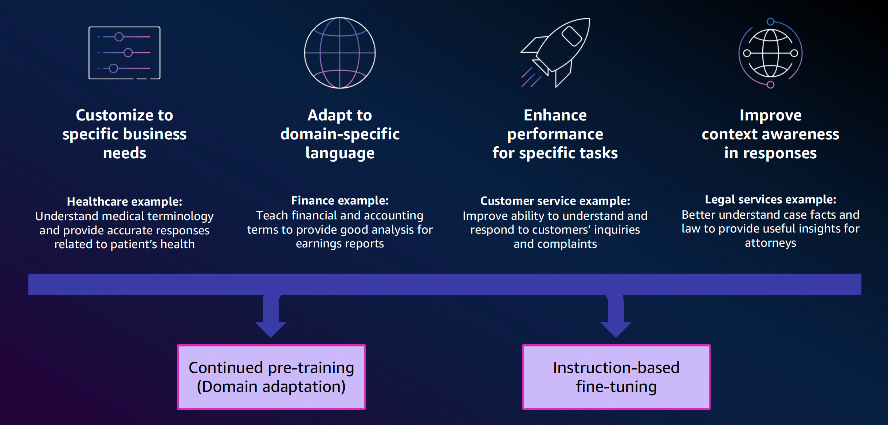
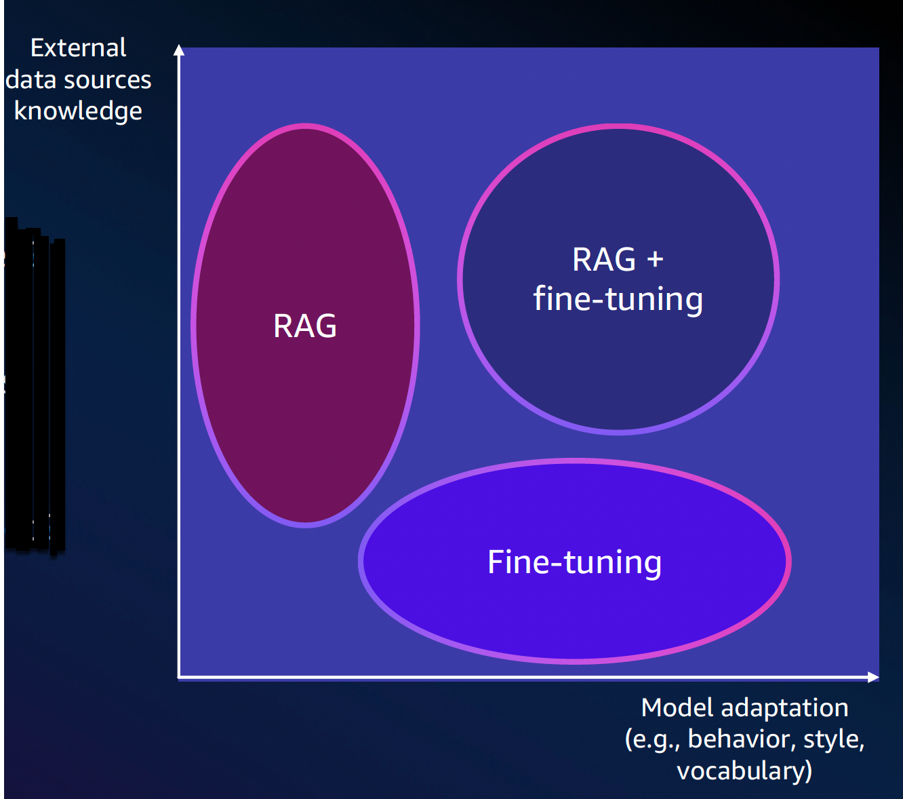
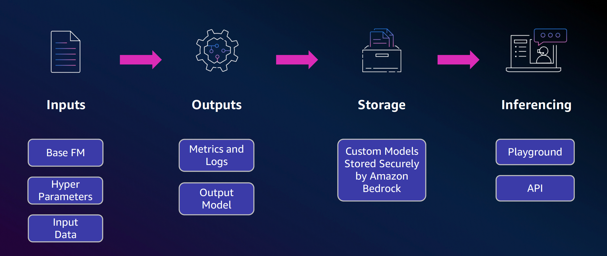

# Fine-tuning models
## Customizing your models
### How FMs benefit from fine-tuning

### Customize vs. augment

### Fine-tuning vs. Retrieval Augmented Generation (RAG)
#### Fine-tuning
- Is specific style, behavior, or vocabulary required?
- Is training data available?
- Do you need to reduce the risk of hallucinations?
#### RAG
- Is knowledge from external data sources required?
- Is data dynamic or changing?
- Do you need to know the sources of answers?

## Custom models in Amazon Bedrock
### Components of a customization job

### Customization architecture overview

### Security and privacy
You are always in control of your data
ü Data not used to improve models, and not shared with model providers
ü Customer data remain in Region
ü Support for AWS PrivateLink and VPC configurations
ü Integration with AWS IAM
ü API monitoring in AWS CloudTrail, logging & metrics in Amazon CloudWatch
ü Custom models encrypted and stored with Service or Customer Managed Keys
(CMK) - Only you have access to your models

### Customizing model responses for your business

### Datasets for instruction

### Model fine-tuning
- Place in S3 your dataset for train, and validation
- jsonl format comprised of instructions { ”prompt": ”input text”, ”completion": ”output text” } Up to 10k training records, and 1k validation records
- Set hyperparameters
- Epoch: 1-10
- Batch size: defaults to 1
- Learning rate: defaults to 0.00005
- Learning warmup steps: recommended 0

### Model continued pre-training
- Place in S3 your dataset for train, and validation
- jsonl format comprised of unlabeled data { ”input": ”input text”} Up to 100k training records, and 1k validation records
- Set hyperparameters
- Epoch: 1-10
- Batch size: defaults to 1
- Learning rate: defaults to 0.00005
- Learning warmup steps: recommended 0

