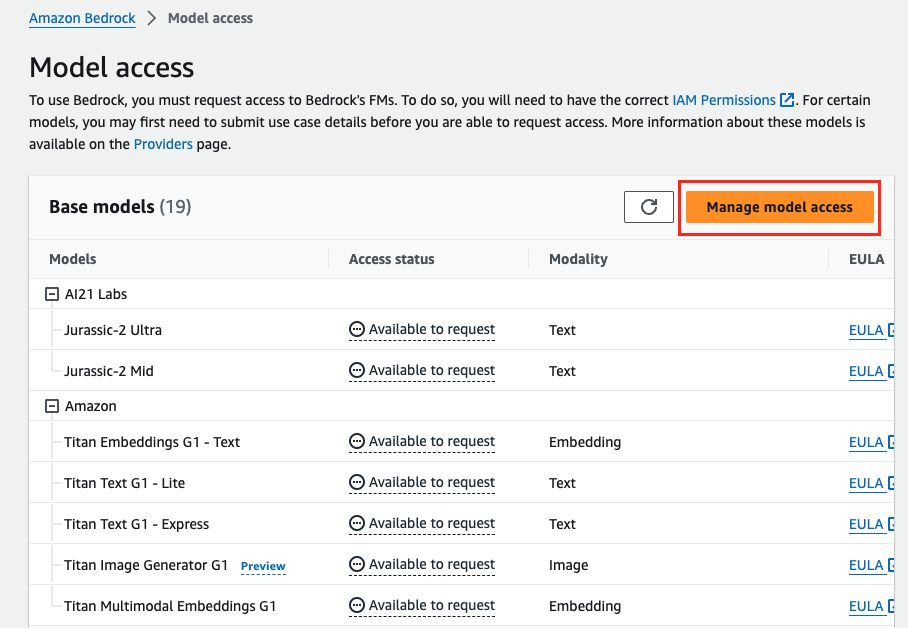
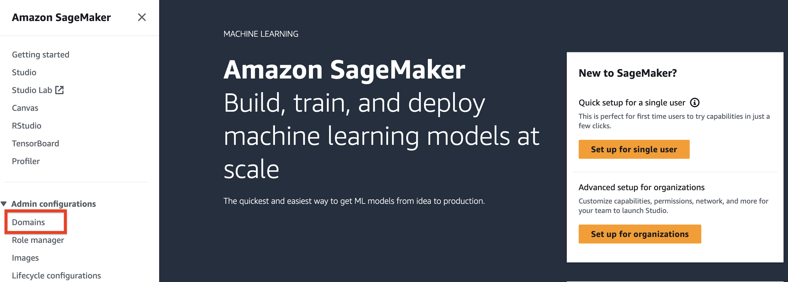
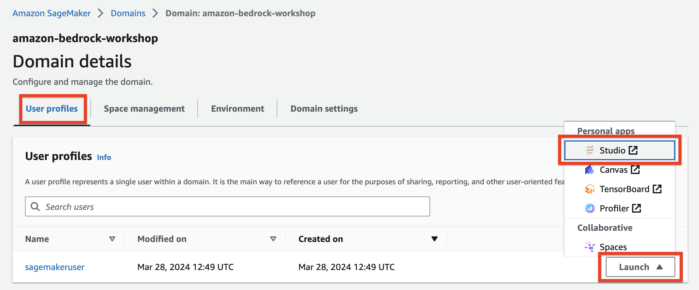
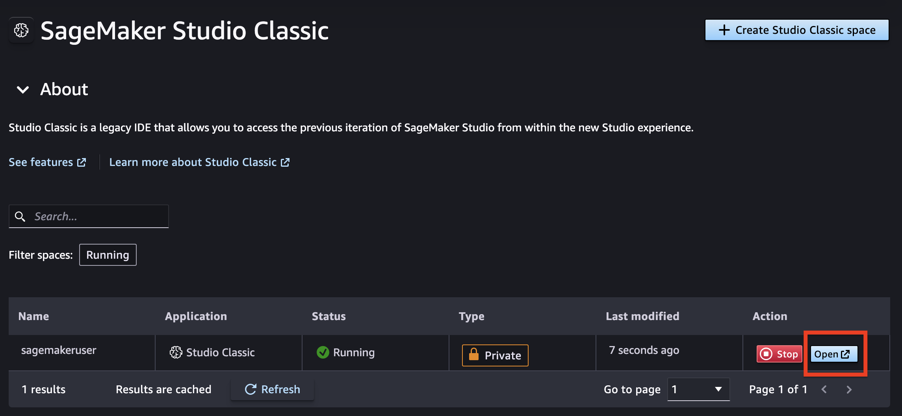
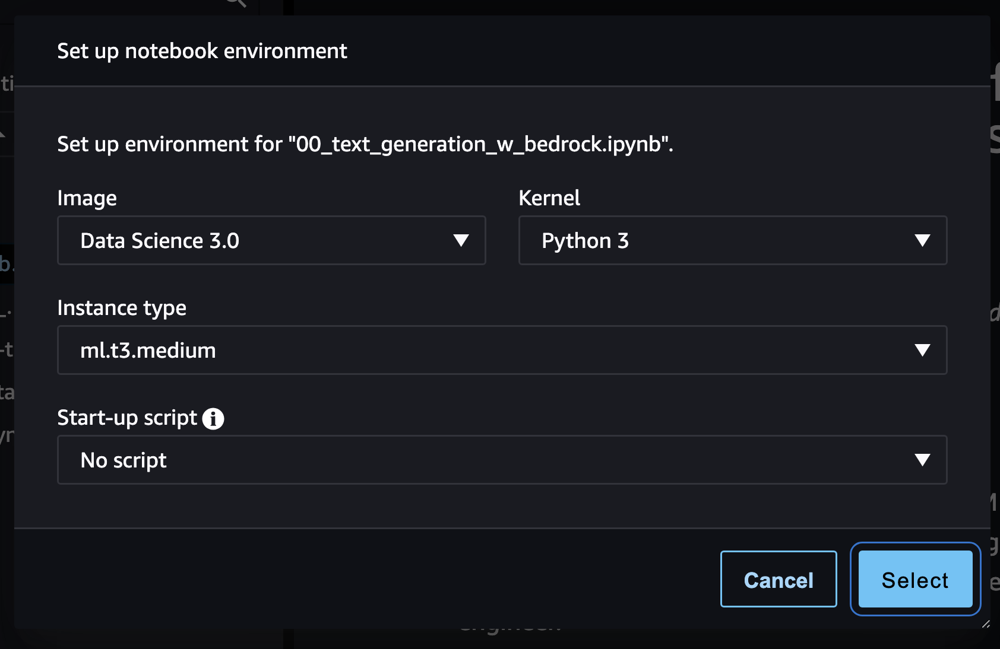

# AWS Console

If you are running this workshop in an AWS event, an AWS account will be provisioned for you.

To get started, go to AWS Console. Go to Amazon Bedrock console and on left menu, click on Model access:

On the Model access screen, click on top right button "Manage model access":

On model access screen, select only following models and click on "Request model access" button:

Amazon
- Titan Embeddings G1 - Text
- Titan Text G1 - Express
Anthropic
- Claude
- Claude Instant
Stability AI
- SDXL 1.0
Mistral AI
- Mistral 7B Instruct

Follow the below steps to launch SageMaker Studio Classic environment
- Launch Amazon SageMaker console and click on Domains in the left pane

Click on the already created Domain amazon-bedrock-workshop If not Please create your domain

Under User profiles, click on the Launch dropdown and click on Studio to launch studio in another window

Within the SageMaker Studio window, click on Studio Classic under Applications to launch SageMaker Studio Classic

Click on Open to launch the SageMaker Studio Classic instance

Click on File Browser to view already cloned git repository and to launch available notebooks

Close the samples from github repo

If you are running the workshop in SageMaker Studio (Classic), here are the recommended kernel configurations:
Image: Data Science 3.0 (or greater)
Instance Type: ml.t3.medium

